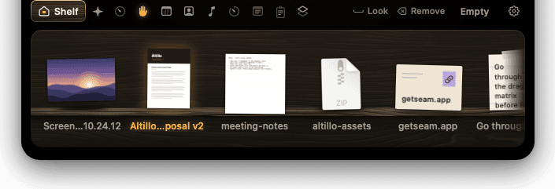
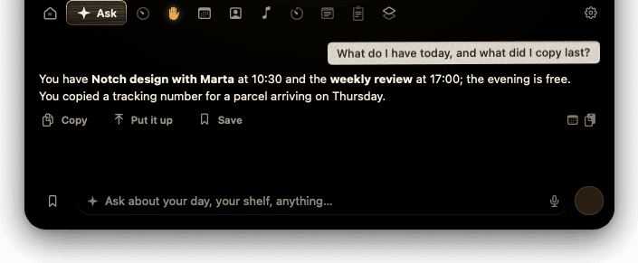
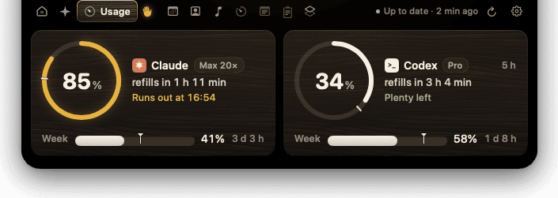
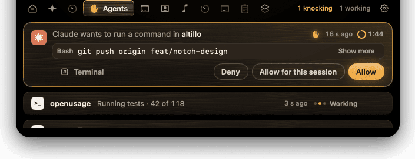
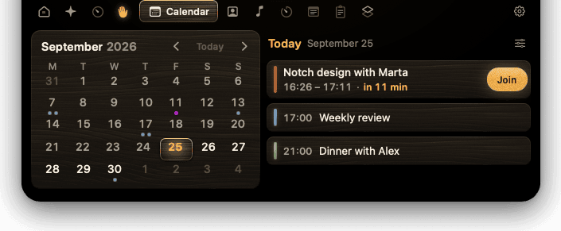
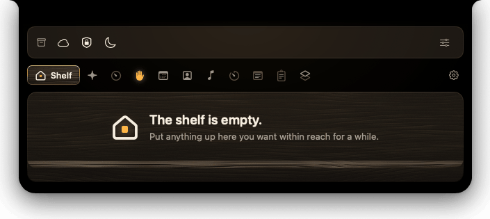

# Altillo

> 🇪🇸 Este README está en inglés para llegar a más gente, pero el plan de
> desarrollo completo está en español: **[PLAN.md](PLAN.md)**.

**Status: actively developed, current version 0.7.1.** Public, notarized
builds are available from [GitHub Releases](https://github.com/XusBadia/altillo/releases/latest)
with Sparkle auto-update. It's a working app used daily, but still pre-1.0 —
expect some rough edges and occasional breaking changes.

Altillo turns your Mac's notch into a small, useful place at the top of your
screen:

- **Shelf** — drop files there for a moment, then drag them out, share them or
  send the current selection by AirDrop (reference, not a permanent home — like Yoink).
- **Ask** — an assistant that runs entirely on your Mac with Apple
  Intelligence and can read what Altillo knows: the files on your shelf, your
  calendar, what's playing and what you copied. Summon it from any app with
  ⌃⌥A; put an answer on the shelf and drag it wherever you need it.
- **Glances** — the notch grows for a few seconds when something matters (a
  meeting in five minutes, a new song if you want it) and goes back on its own.
- **Now Playing** — control the active system media session, including its
  artwork and progress; Apple's Music app and Spotify have a compatibility fallback.
- **AI usage** — how much of your Claude / Codex / … quota you have left, at a
  glance.
- **Live agents** — see your AI coding agents (Claude Code, Codex, …) working,
  waiting for a permission, or done, and approve or deny requests right from
  the notch.
- **Keep Awake** — explicitly keep the Mac awake for 30 minutes, one hour, two
  hours or until you stop it; the display may still turn off and nothing is
  restored after relaunch.
- **Drawer** — keep the menu bar icons you choose in a compact shelf above Altillo's navigation and open their menus from there. Configure it by dragging icons between the Altillo and Menu Bar zones; hiding is available on macOS 26 and requires Accessibility access. [Setup and limitations](docs/cajon.md).
- **iPhone/iPad groundwork** — app and widget targets compile, but the mobile
  companion and Live Activities are placeholders, not shipped features yet.

Altillo is a native macOS 26 app (Swift 6), with iOS/iPadOS and widget
scaffolds plus a small CLI used by AI agent hooks. See [PLAN.md](PLAN.md) for
the full plan: principles, module design, phases, and open decisions.

## Screenshots

**At rest** — the closed notch, with small ears for AI usage and the shelf.


**Shelf** — files dropped on the notch, ready to drag out.



**Ask** — the on-device assistant answering from your calendar and clipboard.



**AI usage** — Claude and Codex quotas, with pace and time to refill.



**Live agents** — a Claude Code permission request, answered from the notch.



**Calendar** — today's events and the month at a glance.



**Drawer** — your chosen menu bar icons in a strip above the navigation.



## Installing

Altillo isn't on the App Store — download the notarized `.dmg` from the
[latest release](https://github.com/XusBadia/altillo/releases/latest), open
it, and drag Altillo to Applications. The app is signed with a Developer ID
certificate and notarized by Apple, so Gatekeeper opens it with no extra
steps. Once installed, Altillo checks for new versions on its own (or via
"Check for Updates…" in the menu bar menu or Settings › About) using
[Sparkle](https://sparkle-project.org/) — see
[docs/release.md](docs/release.md) for how releases are built and signed.

## Requirements

- macOS 26 or later (development machine; the app targets macOS 26+)
- [Xcode 26](https://developer.apple.com/xcode/) or later
- [XcodeGen](https://github.com/yonaskolb/XcodeGen) (`brew install xcodegen`)

## Building

Altillo's Xcode project is generated, not committed — `Altillo.xcodeproj` is
in `.gitignore`.

```sh
brew install xcodegen
xcodegen generate
open Altillo.xcodeproj
```

Then build and run the **Altillo** scheme (macOS) or **AltilloiOS** scheme
(iOS Simulator) as usual.

### Signing (optional)

By default — with no extra setup — Altillo builds with:

- no development team,
- bundle identifier prefix `dev.altillo`,
- ad-hoc code signing (`-`) on macOS.

That's on purpose: it's exactly what CI and a fresh fork see, so the project
builds and runs out of the box with no Apple Developer account. If you have a
team and want push notifications, iCloud sync, or to run on a physical iOS
device, copy the example config and fill in your own values — this file is
git-ignored and never leaves your machine:

```sh
cp Config/Local.xcconfig.example Config/Local.xcconfig
# edit ALTILLO_TEAM, ALTILLO_BUNDLE_PREFIX, ALTILLO_MAC_SIGN_IDENTITY
```

See [docs/desarrollo.md](docs/desarrollo.md) for day-to-day development notes
(Spanish): selecting the right `xcode-select` toolchain, running design
review scenarios, where logs go, and testing on a physical Mac.

### Releasing

Cutting a notarized, Sparkle-signed release (`script/release.sh`, plus the
one-time notarization/Sparkle-key/GitHub Pages setup) is documented in
[docs/release.md](docs/release.md) (Spanish). Not needed for day-to-day
development — only for publishing an actual build.

### Command line

```sh
# AltilloKit package tests
cd Packages/AltilloKit && swift test

# macOS app: build + test (derived data in /tmp: on macOS 27 a test host under
# ~/Documents can hang before it connects, see docs/desarrollo.md)
xcodebuild -project Altillo.xcodeproj -scheme Altillo \
  -derivedDataPath /tmp/altillo-dd-ci test

# iOS app + widget: build for the simulator, no signing required
xcodebuild -project Altillo.xcodeproj -scheme AltilloiOS \
  -destination 'generic/platform=iOS Simulator' \
  -derivedDataPath build/dd-ci-ios CODE_SIGNING_ALLOWED=NO build
```

## Repository layout

```
altillo/
├─ project.yml          XcodeGen spec: every target; Altillo.xcodeproj is not versioned
├─ Config/               xcconfigs; Local.xcconfig (team/bundle/container) is git-ignored
├─ Packages/AltilloKit/  local SwiftPM package, Swift 6
│  ├─ AltilloCore        shared models: UsageSnapshot, AgentSession, ShelfItemRef, Settings
│  ├─ AltilloSync        CloudKit sync (CKSyncEngine), iOS + macOS
│  ├─ AltilloUsage       AI usage collectors (macOS only): Claude, Codex, …
│  ├─ AltilloAgents      agent event protocol, per-agent parsers, state machine
│  └─ AltilloDesign      design tokens, shared components (rings, bars, chips)
├─ Apps/
│  ├─ macOS/             Altillo.app (the notch)
│  ├─ iOS/               iPhone/iPad placeholder target (not shipped yet)
│  ├─ Widgets/           WidgetKit + ActivityKit placeholder target
│  └─ Hook/               altillo-hook: CLI bundled in Altillo.app, used by agent hooks
├─ Tests/                per-package tests and UI tests
├─ docs/                 research, decisions, and dev guides
└─ .github/workflows/    CI
```

See [PLAN.md §2](PLAN.md#2-estructura-del-monorepo) for more detail, including
the identifiers used in `Local.xcconfig`.

## Privacy

- **Your credentials never leave your Mac.** Usage data is read locally
  (keychain / local APIs) and never sent to a third-party server.
- **Altillo never auto-approves anything.** When an AI agent asks for
  permission, Altillo only ever relays your explicit choice — it never
  decides or filters on your behalf. If Altillo is closed, agents behave
  exactly as if the hooks weren't installed (fail open, not silently blocked).

See [PLAN.md §1 (principles)](PLAN.md#1-principios) and
[§5.3 (live agents)](PLAN.md#53-agentes-en-vivo) for the full reasoning.

## License

Altillo is [MIT licensed](LICENSE).

## Acknowledgements

Altillo is a fresh implementation, but it learned from — and in a few small,
explicitly-attributed cases reuses code from — these MIT-licensed open-source
projects (see [ThirdPartyNotices](ThirdPartyNotices/README.md) for exact
attribution as reused code lands):

- [NotchDrop](https://github.com/Lakr233/NotchDrop) (MIT) — the original
  notch shelf.
- [DynamicNotchKit](https://github.com/MrKai77/DynamicNotchKit) (MIT) — notch
  window and shape reference.
- [OpenUsage](https://github.com/robinebers/openusage) (MIT) — AI usage
  provider mappers and pacing/threshold logic. Altillo is **compatible with
  OpenUsage**'s local API as an optional data source, but is not affiliated
  with or endorsed by the OpenUsage project. "OpenUsage" is governed by its
  own trademark policy (`TRADEMARK.md` in that repository), which reserves the
  name for the upstream project; Altillo does not use it as a product name.

A few GPL-licensed notch apps (boring.notch, Ice, Thaw, MewNotch, Atoll) were
read for research and are cited in [PLAN.md](PLAN.md) and
[docs/investigacion.md](docs/investigacion.md) — their code is **not** reused,
since Altillo is MIT-licensed.

## Security

Altillo needs no API keys, and this repository never contains secrets: signing
material and local config are git-ignored, a pre-commit hook and CI scan every
commit with gitleaks, and provider credentials are read from your own Keychain
at runtime and never leave your Mac. See [CONTRIBUTING.md](CONTRIBUTING.md#secrets).
