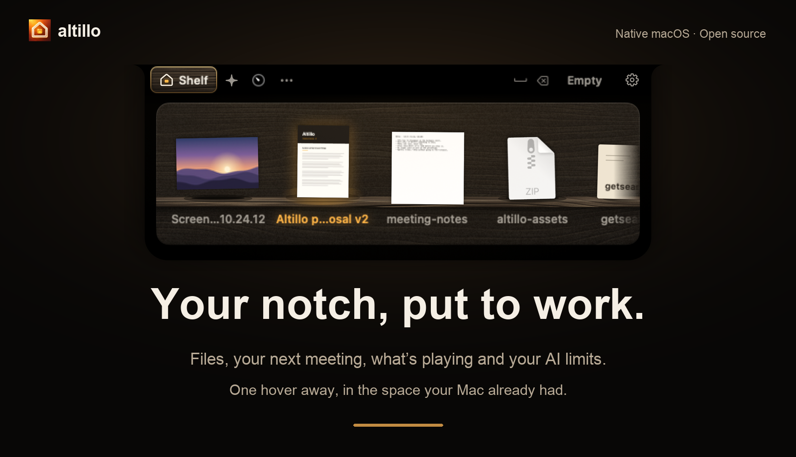

<p align="center">
  <a href="https://altillo.app/">
    
  </a>
</p>

<h1 align="center">Altillo</h1>

<p align="center">
  A native Mac app that turns your notch into a useful place at the top of your screen.
</p>

<p align="center">
  <a href="https://github.com/XusBadia/altillo/releases/latest"><strong>Download for macOS</strong></a> ·
  <a href="https://altillo.app/">Website</a> ·
  <a href="https://github.com/XusBadia/altillo/releases">Release notes</a> ·
  <a href="CONTRIBUTING.md">Contribute</a>
</p>

<p align="center">
  <a href="https://github.com/XusBadia/altillo/releases/latest"></a>
  
  <a href="LICENSE"></a>
</p>

<p align="center">
  <a href="#what-it-does">Features</a> ·
  <a href="#beside-the-notch">Beside the notch</a> ·
  <a href="#screenshots">Screenshots</a> ·
  <a href="#installing">Install</a> ·
  <a href="#support-us-by-trying-aurio">Aurio</a> ·
  <a href="#building">Build from source</a> ·
  <a href="#privacy">Privacy</a>
</p>

> 🇪🇸 Este README está en inglés para llegar a más gente. El [plan de desarrollo](PLAN.md)
> y la [guía de desarrollo](docs/desarrollo.md) están en español.

Actively developed and used daily, with signed, notarized releases and automatic
updates. Altillo is still pre-1.0, so expect some rough edges and occasional
breaking changes.

## What it does

| Feature | In your notch |
| --- | --- |
| **Beside the notch** | See your next meeting, current song, AI usage, agent activity or shelf count while Altillo is closed. Configure each side, or let “What matters now” choose what needs your attention, including active timers. |
| **Shelf** | Drop files for a moment, then drag them out, share them or AirDrop the current selection. A temporary shelf of references, not a permanent home. |
| **Ask** | An on-device assistant powered by Apple Intelligence, with context from your shelf, calendar, music and clipboard. Summon it from any app with ⌃⌥A; put an answer on the shelf and drag it wherever you need it. |
| **Glances** | A brief heads-up for a meeting in five minutes or a new song, then the notch closes on its own. |
| **Now Playing** | Control the active media session, with artwork and progress. Load synced lyrics on demand; Apple Music and Spotify have a compatibility fallback. |
| **AI usage** | Check your remaining Claude, Codex and other provider quotas, with a private 30-day trend kept on your Mac. |
| **Live agents** | Follow Claude Code, Codex, Gemini CLI, Copilot CLI, Cursor and OpenCode. See requests, running sessions and finished work; approve, deny or reply from the notch when the agent’s hooks or local API support it. |
| **Calendar** | See today's events and the month at a glance. |
| **Mirror** | Check your camera preview without opening another app. |
| **Timers & focus** | Run several named timers or a persistent Pomodoro cycle, with a countdown beside the notch and a glance when time is up. |
| **Reminders** | See, complete or open today's and upcoming reminders. |
| **Clipboard** | Search recently copied text, images and file references, then copy or paste them back. Image text recognition runs on your Mac; keeping history after quitting is optional. |
| **Note & Shortcuts** | Write a quick note you can drag into another app, and run your favourite Apple Shortcuts from the notch. |
| **Keep Awake** | Keep your Mac awake for 30 minutes, one hour, two hours or until you stop it. The display may still turn off; the setting resets on relaunch. |
| **Drawer** | Keep rarely used menu bar icons above Altillo's navigation and open their menus there. On macOS 27, their icons leave the menu bar entirely. Requires Accessibility; optional icon capture also needs screen-capture permission. [Setup and limitations](docs/cajon.md). |

Built with Swift 6 for macOS 26+. iPhone, iPad, widget and Live Activity targets
are groundwork only; the mobile companion is not shipped yet. See [PLAN.md](PLAN.md)
for the module design, roadmap and open decisions.

## Beside the notch

Useful information stays visible on either side, even while Altillo is closed.
The sides grow to fit what they show: a meeting's time and title, a song's artwork
and name, an AI provider and its usage, or the agent waiting for you.

<p align="center">
  
  <br>
  <sub>AI usage on the left, your shelf count on the right.</sub>
</p>

<p align="center">
  
  <br>
  <sub>An agent needs your attention, without opening the panel.</sub>
</p>

Click either side to open its section. Right-click the notch and choose
**Customize…** to configure each side. With **What matters now**, Altillo picks
the most relevant activity and can fill an empty side with the next one.

## Screenshots

These are the app's design-review scenarios, with sample files, quotas and agent
sessions. Your enabled sections and panel size can differ.

| Shelf · drop files, drag them out | Ask · answers from your Mac |
| :---: | :---: |
|  |  |

| AI usage · quotas, pace and refill | Live agents · permission requests |
| :---: | :---: |
|  |  |

| Calendar · events and month view | Drawer · your menu bar icons |
| :---: | :---: |
|  |  |

## Installing

Requires **macOS 26 or later**. Altillo isn't on the App Store — download the
notarized `.dmg` from the
[latest release](https://github.com/XusBadia/altillo/releases/latest), open
it, and drag Altillo to Applications. The app is signed with a Developer ID
certificate and notarized by Apple, so Gatekeeper opens it with no extra
steps. Once installed, Altillo checks for new versions on its own (or via
"Check for Updates…" in the menu bar menu or Settings › About) using
[Sparkle](https://sparkle-project.org/) — see
[docs/release.md](docs/release.md) for how releases are built and signed.

## Support us by trying Aurio

<p align="center">
  <a href="https://www.aurioapp.com">
    
  </a>
</p>

Help us keep building Altillo by trying our other app. Use **Aurio** to track
expenses, manage shared accounts and follow your net worth.

**[Meet Aurio →](https://www.aurioapp.com)**

## Building

To build from source, you need:

- macOS 26 or later
- [Xcode 26](https://developer.apple.com/xcode/) or later
- [XcodeGen](https://github.com/yonaskolb/XcodeGen) (`brew install xcodegen`)

Altillo's Xcode project is generated, not committed — `Altillo.xcodeproj` is
in `.gitignore`.

```sh
brew install xcodegen
xcodegen generate
open Altillo.xcodeproj
```

Then build and run the **Altillo** scheme (macOS) or **AltilloiOS** scheme
(iOS Simulator) as usual.

### Signing (optional)

By default — with no extra setup — Altillo builds with:

- no development team,
- bundle identifier prefix `dev.altillo`,
- ad-hoc code signing (`-`) on macOS.

That's on purpose: it's exactly what CI and a fresh fork see, so the project
builds and runs out of the box with no Apple Developer account. If you have a
team and want push notifications, iCloud sync, or to run on a physical iOS
device, copy the example config and fill in your own values — this file is
git-ignored and never leaves your machine:

```sh
cp Config/Local.xcconfig.example Config/Local.xcconfig
# edit ALTILLO_TEAM, ALTILLO_BUNDLE_PREFIX, ALTILLO_MAC_SIGN_IDENTITY
```

See [docs/desarrollo.md](docs/desarrollo.md) for day-to-day development notes
(Spanish): selecting the right `xcode-select` toolchain, running design
review scenarios, where logs go, and testing on a physical Mac.

### Releasing

Cutting a notarized, Sparkle-signed release (`script/release.sh`, plus the
one-time notarization/Sparkle-key/GitHub Pages setup) is documented in
[docs/release.md](docs/release.md) (Spanish). Not needed for day-to-day
development — only for publishing an actual build.

### Command line

```sh
# AltilloKit package tests
(cd Packages/AltilloKit && swift test)

# macOS app: build + test (derived data in /tmp: on macOS 27 a test host under
# ~/Documents can hang before it connects, see docs/desarrollo.md)
xcodebuild -project Altillo.xcodeproj -scheme Altillo \
  -derivedDataPath /tmp/altillo-dd-ci test

# iOS app + widget: build for the simulator, no signing required
xcodebuild -project Altillo.xcodeproj -scheme AltilloiOS \
  -destination 'generic/platform=iOS Simulator' \
  -derivedDataPath build/dd-ci-ios CODE_SIGNING_ALLOWED=NO build
```

## Repository layout

```
altillo/
├─ project.yml          XcodeGen spec: every target; Altillo.xcodeproj is not versioned
├─ Config/               xcconfigs; Local.xcconfig (team/bundle/container) is git-ignored
├─ Packages/AltilloKit/  local SwiftPM package, Swift 6
│  ├─ AltilloCore        shared models: UsageSnapshot, AgentSession, ShelfItemRef, Settings
│  ├─ AltilloSync        CloudKit sync (CKSyncEngine), iOS + macOS
│  ├─ AltilloUsage       AI usage collectors (macOS only): Claude, Codex, …
│  ├─ AltilloAgents      agent event protocol, per-agent parsers, state machine
│  └─ AltilloDesign      design tokens, shared components (rings, bars, chips)
├─ Apps/
│  ├─ macOS/             Altillo.app (the notch)
│  ├─ iOS/               iPhone/iPad placeholder target (not shipped yet)
│  ├─ Widgets/           WidgetKit + ActivityKit placeholder target
│  └─ Hook/               altillo-hook: CLI bundled in Altillo.app, used by agent hooks
├─ Tests/                per-package tests and UI tests
├─ docs/                 research, decisions, and dev guides
└─ .github/workflows/    CI
```

See [PLAN.md §2](PLAN.md#2-estructura-del-monorepo) for more detail, including
the identifiers used in `Local.xcconfig`.

## Agent hooks

Hooks are small commands that an AI CLI runs when its state changes. They let
Altillo receive precise live events and, where the CLI supports it, relay your
explicit permission or reply from the notch. They are optional: Altillo can
still detect Claude Code, Codex and Gemini sessions from their local session
files, with less detail; OpenCode uses its local API and needs no hook.

There is no universal hook shared by every CLI. Each agent owns a different
configuration file, so install Altillo's hooks separately for each one you use
in **Settings › Sections › Agents**. Altillo shows the exact diff before it
writes, backs up an existing file, and never removes another tool's hooks.
Codex also asks you to trust new or changed hooks with `/hooks`.

Before deleting Altillo, open **Settings › Sections › Agents › Prepare to
Uninstall…**. Review each target and remove the selected hooks first. Homebrew's
`brew uninstall --zap altillo` cannot safely perform this step: a cask cannot
edit shared third-party configuration without risking unrelated settings.
See the [safe uninstall guide](docs/desinstalacion-segura.md).

## Privacy

- **Altillo has no analytics or telemetry service.** Your files, calendar,
  clipboard, camera image, agent sessions and Ask conversations are not sent
  to Altillo.
- **Usage checks contact each provider directly.** Altillo reads the sign-in
  or API key that the provider's own tool already stores on your Mac, then
  presents that credential only to the same provider to request your quota.
  It does not refresh, rewrite or retain a copy of the credential.
- **Ask is on-device by default.** If you allow web search for one question or
  in Settings, Altillo sends a short search derived from that question to the
  search, weather or reference service named in the privacy policy.
- **Lyrics are opt-in per track.** Pressing “Load Lyrics” sends that track's
  title, artist, album and duration to LRCLIB; no audio or music library is uploaded.
- **Drawer icon capture is optional.** If enabled, macOS screen-capture permission
  lets Altillo capture menu bar icons for the Drawer. Images stay on your Mac.
- **Altillo never auto-approves anything.** When an AI agent asks for
  permission, Altillo only ever relays your explicit choice — it never
  decides or filters on your behalf. If Altillo is closed, agents behave
  exactly as if the hooks weren't installed (fail open, not silently blocked).

See the [privacy policy](https://altillo.app/privacy/) for every network
destination, local storage and retention, and [PLAN.md §1](PLAN.md#1-principios)
and [§5.3](PLAN.md#53-agentes-en-vivo) for the design reasoning.

## License

Altillo is [MIT licensed](LICENSE).

## Acknowledgements

Altillo is a fresh implementation, but it learned from — and in a few small,
explicitly-attributed cases reuses code from — these MIT-licensed open-source
projects (see [ThirdPartyNotices](ThirdPartyNotices/README.md) for exact
attribution as reused code lands):

- [NotchDrop](https://github.com/Lakr233/NotchDrop) (MIT) — the original
  notch shelf.
- [DynamicNotchKit](https://github.com/MrKai77/DynamicNotchKit) (MIT) — notch
  window and shape reference.
- [OpenUsage](https://github.com/robinebers/openusage) (MIT) — AI usage
  provider mappers and pacing/threshold logic. Altillo reads providers itself;
  it does not require or connect to an OpenUsage installation. Altillo is not
  affiliated with or endorsed by the OpenUsage project. "OpenUsage" is
  governed by its own trademark policy (`TRADEMARK.md` in that repository),
  which reserves the name for the upstream project; Altillo does not use it as
  a product name.

A few GPL-licensed notch apps (boring.notch, Ice, Thaw, MewNotch, Atoll) were
read for research and are cited in [PLAN.md](PLAN.md) and
[docs/investigacion.md](docs/investigacion.md) — their code is **not** reused,
since Altillo is MIT-licensed.

## Security

Altillo has no service or API key of its own, and this repository never
contains secrets: signing material and local config are git-ignored, a
pre-commit hook and CI scan every commit with gitleaks, and provider
credentials are read from your own Keychain or the provider tool's config at
runtime. They are used only to request usage from that same provider. See
[CONTRIBUTING.md](CONTRIBUTING.md#secrets) and the [privacy
policy](https://altillo.app/privacy/).
